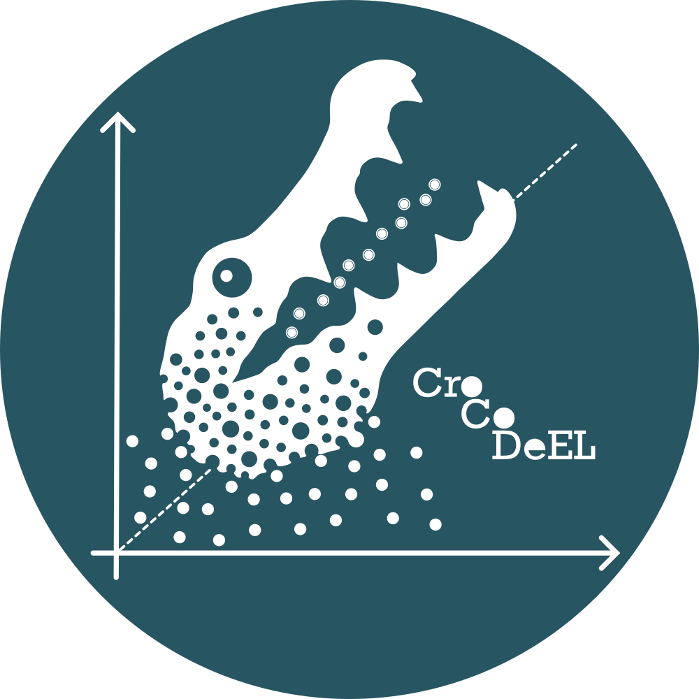

#  CroCoDeEL: Cross-sample Contamination Detection and Estimation of its Level 🐊

[](https://anaconda.org/bioconda/crocodeel)
[](https://pypi.org/project/crocodeel/)
[](https://codecov.io/github/metagenopolis/CroCoDeEL)
[](https://doi.org/10.5281/zenodo.14708154)

## Introduction

### What is CroCoDeEL?
CroCoDeEL is a tool that detects cross-sample contamination (aka well-to-well leakage) in shotgun metagenomic data.\
It accurately identifies contaminated samples but also pinpoints contamination sources and estimates contamination rates.\
CroCoDeEL relies only on species abundance tables and does not need negative controls nor sample position during processing (i.e. plate maps).

### What CroCoDeEL is not
- CroCoDeEL is not designed to detect external or reagent contamination, as addressed by tools such as [decontam](https://doi.org/10.1186/s40168-018-0605-2) or [SCRuB](https://doi.org/10.1038/s41587-023-01696-w).
- CroCoDeEL detects and quantifies cross-contamination, but it does not yet provide a decontamination module.
- CroCoDeEL was developed for complex microbial communities and is not intended for isolate genomics or low-complexity microbial communities.

<p align="center">
  
</p>

## Installation

CroCoDeEL is available on [bioconda](https://anaconda.org/channels/bioconda/packages/crocodeel/overview):
```
conda create --name crocodeel_env -c conda-forge -c bioconda crocodeel
conda activate crocodeel_env
```

Alternatively, you can use [pip](https://pypi.org/project/crocodeel/) with Python ≥ 3.12:
```
pip install crocodeel
```

Docker and Singularity containers are also available on [BioContainers](https://biocontainers.pro/tools/crocodeel)

For relatively small datasets (< 200 samples), CroCoDeEL can also be run directly from the web interface available at https://metagenopolis.github.io/CroCoDeEL_interpreter/#runCroCoDeEL

## Self-test

To verify that CroCoDeEL is working correctly, run the following command:

```bash
crocodeel self_test
```
This command runs CroCoDeEL on a toy dataset and checks whether the generated results match the expected ones.  
To inspect the generated results, rerun the command with the `--keep-results` option.

## Quick start
### Input
CroCoDeEL takes as input a species abundance table in TSV format.\
The first column should correspond to species names. The other columns correspond to the abundance of species in each sample.\
An example is available [here](crocodeel/test_data/mgs_profiles_test.tsv).

|   species_name  | sample1 | sample2 | sample3 |    ...   | 
|:----------------|:-------:|:-------:|:-------:|:--------:| 
| species 1       |   0     |  0.05   |   0.07  |    ...   | 
| species 2       |   0.1   |  0.01   |   0     |    ...   | 
|       ...       |   ...   |   ...   |   ...   |    ...   | 

CroCoDeEL works with relative abundances.
The table will automatically be normalized so the abundance of each column equals 1.

**Important:** CroCoDeEL relies on accurate estimation of low-abundance (subdominant) species.\
We therefore strongly recommend using [Meteor](https://github.com/metagenopolis/meteor) to generate the species abundance table.

Alternatively, [MetaPhlAn4](https://github.com/biobakery/metaphlan) or [sylph](https://github.com/bluenote-1577/sylph) can also be used,
although their lower sensitivity for low-abundance species may reduce the detection of low-level contamination events.\
Based on our benchmarks, we do not recommend using other taxonomic profilers, as they generally do not provide sufficiently accurate abundance estimates for subdominant species.

#### Using MetaPhlAn4
When using MetaPhlAn4, profiling should be performed at the SGB level using the option `--tax_lev t`.\
Alternatively, if you already have a MetaPhlAn abundance table, filter the `clade_name` column to retain only rows containing `t__SGB`.\
CroCoDeEL should then be run with the `--filter-low-ab` parameter, as described below.

#### Using sylph
For sylph, we recommend using [GTDB representative genomes](https://gtdb.ecogenomic.org/) as the reference database and generating an MPA-style abundance table with [sylph-tax](https://github.com/bluenote-1577/sylph-tax).\
The resulting abundance table should then be filtered to retain only species-level entries corresponding to the `t__` taxonomic rank.

### Search for contamination
Run the following command to identify cross-sample contamination:
```
crocodeel search_conta -s species_abundance.tsv -c contamination_events.tsv
```
CroCoDeEL will output all detected contamination events in the file _contamination_events.tsv_.\
This TSV file includes the following details for each contamination event:
- The contamination source
- The contaminated sample (target)
- The estimated contamination rate
- The score (probability) computed by the Random Forest model
- The species specifically introduced into the target by contamination

An example output file is available [here](crocodeel/test_data/results/contamination_events.tsv).

If you are using MetaPhlan4, we strongly recommend filtering out low-abundance species to improve CroCoDeEL's sensitivity.\
Use the _--filter-low-ab_ option as shown below:
```
crocodeel search_conta -s species_abundance.tsv --filter-low-ab 20 -c contamination_events.tsv
```

### Visualization of the results
Contaminations events can be visually inspected by generating a PDF file consisting in scatterplots.
```
crocodeel plot_conta -s species_abundance.tsv -c contamination_events.tsv -r contamination_events.pdf
```
Each scatterplot compares in a log-scale the species abundance profiles of a contaminated sample (x-axis) and its contamination source (y-axis).\
The contamination line (in red) highlights species specifically introduced by contamination.\
An example is available [here](crocodeel/test_data/results/contamination_events.pdf).

### Easy workflow
Alternatively, you can search for cross-sample contamination and create the PDF report in one command.
```
crocodeel easy_wf -s species_abundance.tsv -c contamination_events.tsv -r contamination_events.pdf
```

### Results interpretation

CroCoDeEL is a decision-support tool and **should not be considered a definitive contamination classification system**.
It may report false-positive contamination events, particularly for samples with similar species abundance profiles (e.g. longitudinal samples).

For this reason, we strongly recommend manually reviewing the scatterplots associated with each predicted contamination event to identify and discard potential false positives.\
To learn how to interpret these scatterplots, please refer to this [tutorial](https://metagenopolis.github.io/CroCoDeEL_interpreter/#learn).

For a more efficient review workflow, we also recommend using the [CroCoDeEL Interpretation Interface](https://metagenopolis.github.io/CroCoDeEL_interpreter/), which provides an interactive environment for exploring and validating CroCoDeEL results.

### Reproduce results of the paper
Species abundance tables of the training, validation and test datasets are available in this [repository](https://doi.org/10.57745/N6JSHQ).  
You can use CroCoDeEL to analyze these tables and reproduce the results presented in the paper.  
For example, to process Plate 3 from the Lou et al. dataset, first download the species abundance table:  
```
wget --content-disposition 'https://entrepot.recherche.data.gouv.fr/api/access/datafile/:persistentId?persistentId=doi:10.57745/BH1RKY'
```
and then run CroCoDeEL:  
```
crocodeel easy_wf -s PRJNA698986_P3.meteor.tab -c PRJNA698986_P3.meteor.crocodeel.tsv -r PRJNA698986_P3.meteor.crocodeel.pdf
```

### Train a new Random Forest model
Advanced users can train a custom Random Forest model, which classifies sample pairs as contaminated or not.  
You will need a species abundance table with labeled **contaminated** and **non-contaminated** sample pairs, to be used for training and testing.  
To get started, you can download and decompress the dataset we used to train CroCoDeEL's default model:  
```
wget --content-disposition 'https://entrepot.recherche.data.gouv.fr/api/access/datafile/:persistentId?persistentId=doi:10.57745/IBIPVG'
xz -d training_dataset.meteor.tsv.xz
```
Then, use the following command to train a new model:  
```
crocodeel train_model -s training_dataset.meteor.tsv -m crocodeel_model.joblib -r crocodeel_model_perf.json
```
Finally, to use your trained model instead of the default one, pass it with the _-m_ option:  
```
crocodeel search_conta -s species_ab.tsv -m crocodeel_model.tsv -c conta_events.tsv
```

## Citation
If you find CroCoDeEL useful, please cite:\
Goulet, L. et al. "CroCoDeEL: accurate control-free detection of cross-sample contamination in metagenomic data" *Nature Communications* (2026). [https://doi.org/10.1038/s41467-026-72637-9](https://doi.org/10.1038/s41467-026-72637-9).
