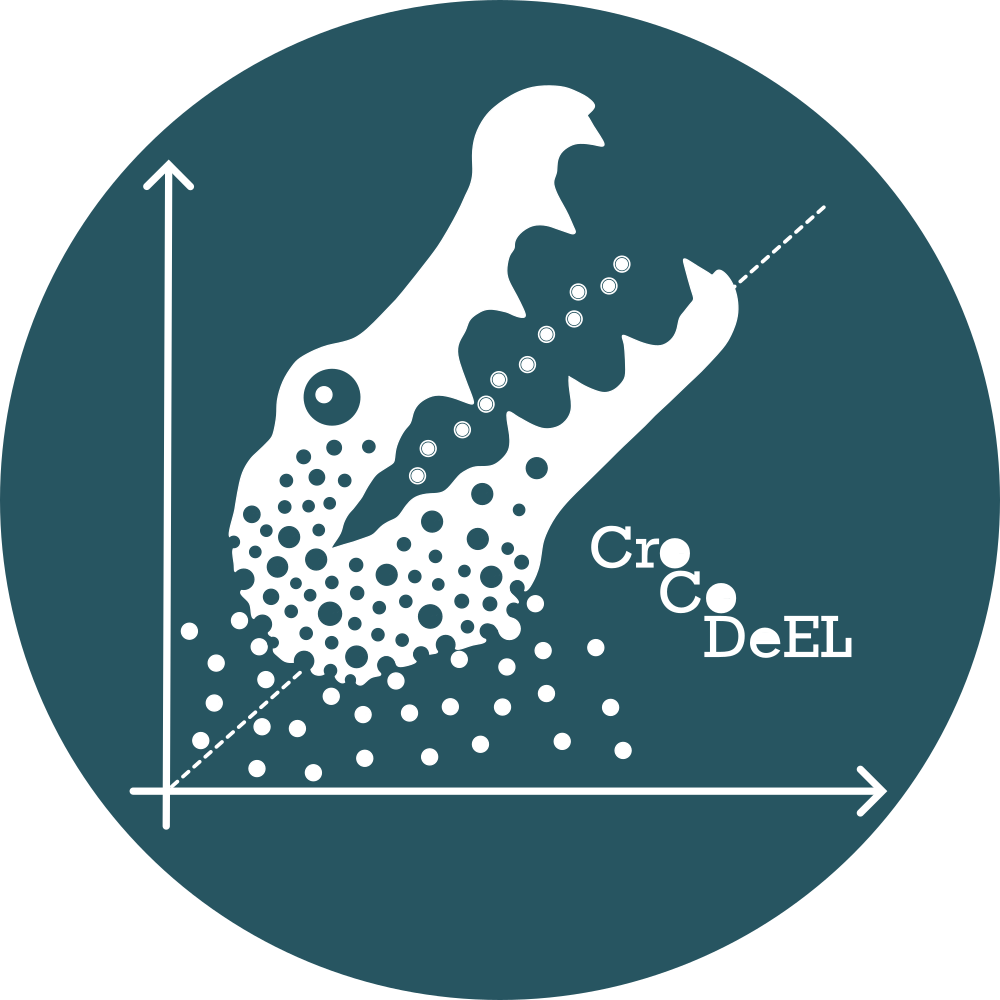

#  CroCoDeEL : **CRO**ss-sample **CO**ntamination **DE**tection and **E**stimation of its **L**evel 🐊

[](https://anaconda.org/bioconda/crocodeel)
[](https://pypi.org/project/crocodeel/)
[](https://doi.org/10.5281/zenodo.14708155)

## Introduction

CroCoDeEL is a tool that detects cross-sample contamination (aka well-to-well leakage) in shotgun metagenomic data.\
It accurately identifies contaminated samples but also pinpoints contamination sources and estimates contamination rates.\
CroCoDeEL relies only on species abundance tables and does not need negative controls nor sample position during processing (i.e. plate maps).

<p align="center">
  
</p>

## Installation

CroCoDeEL is available on bioconda:
```
conda create --name crocodeel_env -c conda-forge -c bioconda crocodeel
conda activate crocodeel_env
```

Alternatively, you can use pip with Python ≥ 3.12:
```
pip install crocodeel
```

Docker and Singularity containers are also available on [BioContainers](https://biocontainers.pro/tools/crocodeel)

## Installation test

To verify that CroCoDeEL is installed correctly, run the following command:  
```
crocodeel test_install
```
This command runs CroCoDeEL on a toy dataset and checks whether the generated results match the expected ones.  
To inspect the results, you can rerun the command with the `--keep-results` parameter.

## Quick start
### Input
CroCoDeEL takes as input a species abundance table in TSV format.\
The first column should correspond to species names. The other columns correspond to the abundance of species in each sample.\
An example is available [here](crocodeel/test_data/mgs_profiles_test.tsv).

|   species_name  | sample1 | sample2 | sample3 |    ...   | 
|:----------------|:-------:|:-------:|:-------:|:--------:| 
| species 1       |   0     |  0.05   |   0.07  |    ...   | 
| species 2       |   0.1   |  0.01   |   0     |    ...   | 
|       ...       |   ...   |   ...   |   ...   |    ...   | 

CroCoDeEL works with relative abundances.
The table will automatically be normalized so the abundance of each column equals 1.

**Important**: CroCoDeEL requires accurate estimation of the abundance of subdominant species.\
We strongly recommend using [the Meteor software suite](https://github.com/metagenopolis/meteor) to generate the species abundance table.\
Alternatively, MetaPhlan4 can be used (parameter: --tax\_level t), although it will fail to detect low-level contaminations.\
We advise against using other taxonomic profilers that, according to our benchmarks, do not meet this requirement.

### Search for contamination
Run the following command to identify cross-sample contamination:
```
crocodeel search_conta -s species_abundance.tsv -c contamination_events.tsv
```
CroCoDeEL will output all detected contamination events in the file _contamination_events.tsv_.\
This TSV file includes the following details for each contamination event:
- The contamination source
- The contaminated sample (target)
- The estimated contamination rate
- The score (probability) computed by the Random Forest model
- The species specifically introduced into the target by contamination

An example output file is available [here](crocodeel/test_data/results/contamination_events.tsv).

If you are using MetaPhlan4, we strongly recommend filtering out low-abundance species to improve CroCoDeEL's sensitivity.\
Use the _--filter-low-ab_ option as shown below:
```
crocodeel search_conta -s species_abundance.tsv --filter-low-ab 20 -c contamination_events.tsv
```

### Visualization of the results
Contaminations events can be visually inspected by generating a PDF file consisting in scatterplots.
```
crocodeel plot_conta -s species_abundance.tsv -c contamination_events.tsv -r contamination_events.pdf
```
Each scatterplot compares in a log-scale the species abundance profiles of a contaminated sample (x-axis) and its contamination source (y-axis).\
The contamination line (in red) highlights species specifically introduced by contamination.\
An example is available [here](crocodeel/test_data/results/contamination_events.pdf).

### Easy workflow
Alternatively, you can search for cross-sample contamination and create the PDF report in one command.
```
crocodeel easy_wf -s species_abundance.tsv -c contamination_events.tsv -r contamination_events.pdf
```

### Results interpretation
CroCoDeEL will probably report false contamination events for samples with similar species abundances profiles (e.g. longitudinal data, animals raised together).\
For non-related samples, CroCoDeEL may occasionally generate false positives that can be filtered out by a human-expert.\
Thus, we strongly recommend inspecting scatterplots of each contamination event to discard potential false positives.\
Please check the [wiki](https://github.com/metagenopolis/CroCoDeEL/wiki) for more information.

### Reproduce results of the paper
Species abundance tables of the training, validation and test datasets are available in this [repository](https://doi.org/10.57745/N6JSHQ).  
You can use CroCoDeEL to analyze these tables and reproduce the results presented in the paper.  
For example, to process Plate 3 from the Lou et al. dataset, first download the species abundance table:  
```
wget --content-disposition 'https://entrepot.recherche.data.gouv.fr/api/access/datafile/:persistentId?persistentId=doi:10.57745/BH1RKY'
```
and then run CroCoDeEL:  
```
crocodeel easy_wf -s PRJNA698986_P3.meteor.tab -c PRJNA698986_P3.meteor.crocodeel.tsv -r PRJNA698986_P3.meteor.crocodeel.pdf
```

### Train a new Random Forest model
Advanced users can train a custom Random Forest model, which classifies sample pairs as contaminated or not.  
You will need a species abundance table with labeled **contaminated** and **non-contaminated** sample pairs, to be used for training and testing.  
To get started, you can download and decompress the dataset we used to train CroCoDeEL's default model:  
```
wget --content-disposition 'https://entrepot.recherche.data.gouv.fr/api/access/datafile/:persistentId?persistentId=doi:10.57745/IBIPVG'
xz -d training_dataset.meteor.tsv.xz
```
Then, use the following command to train a new model:  
```
crocodeel train_model -s training_dataset.meteor.tsv -m crocodeel_model.tsv -r crocodeel_model_perf.tsv
```
Finally, to use your trained model instead of the default one, pass it with the _-m_ option:  
```
crocodeel search_conta -s species_ab.tsv -m crocodeel_model.tsv -c conta_events.tsv
```

## Citation
If you find CroCoDeEL useful, please cite:\
Goulet, L. et al. "CroCoDeEL: accurate control-free detection of cross-sample contamination in metagenomic data" *bioRxiv* (2025). [https://doi.org/10.1101/2025.01.15.633153](https://doi.org/10.1101/2025.01.15.633153).
